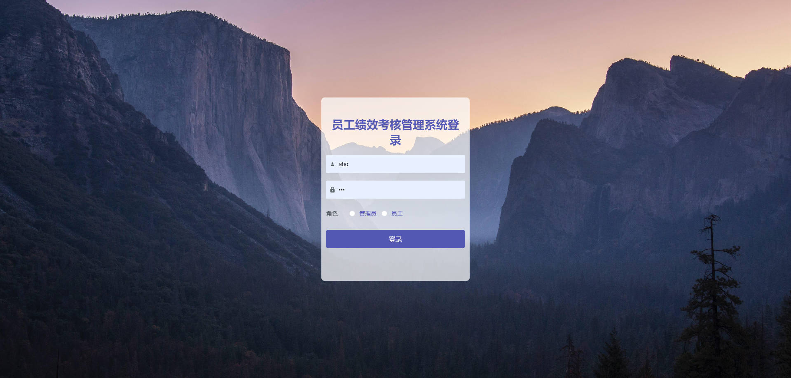
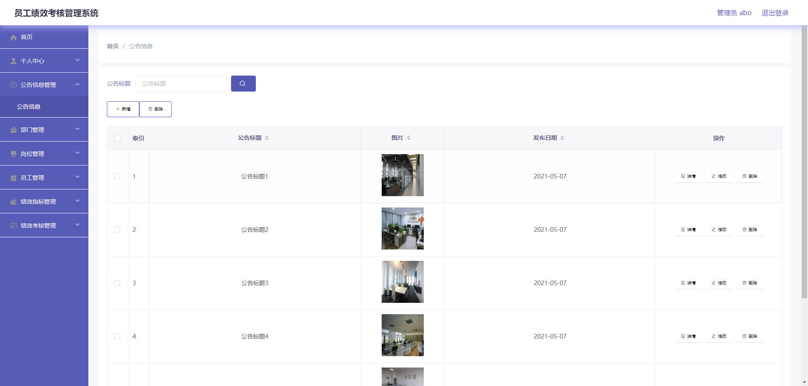
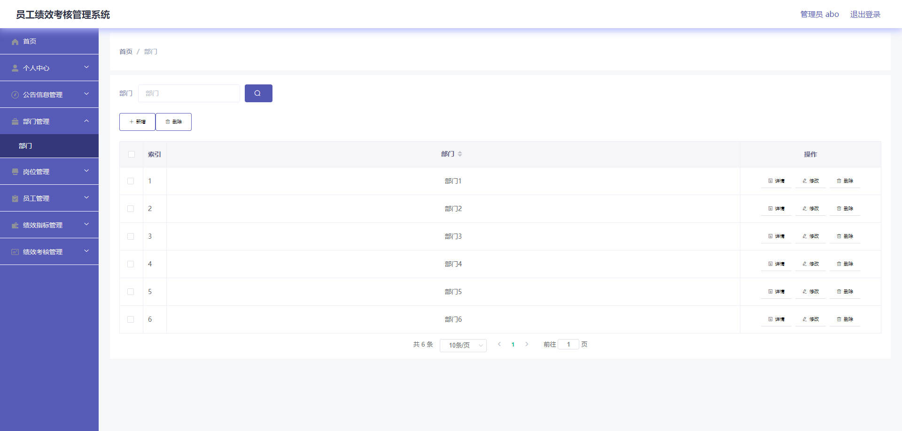
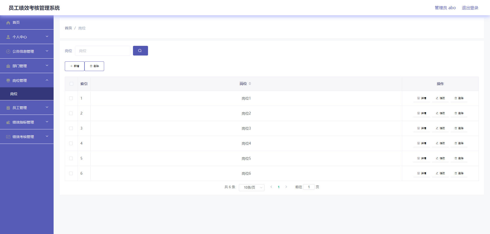
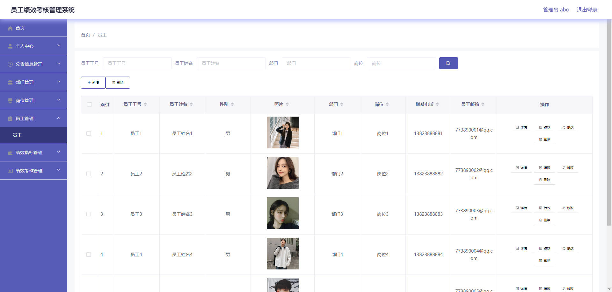
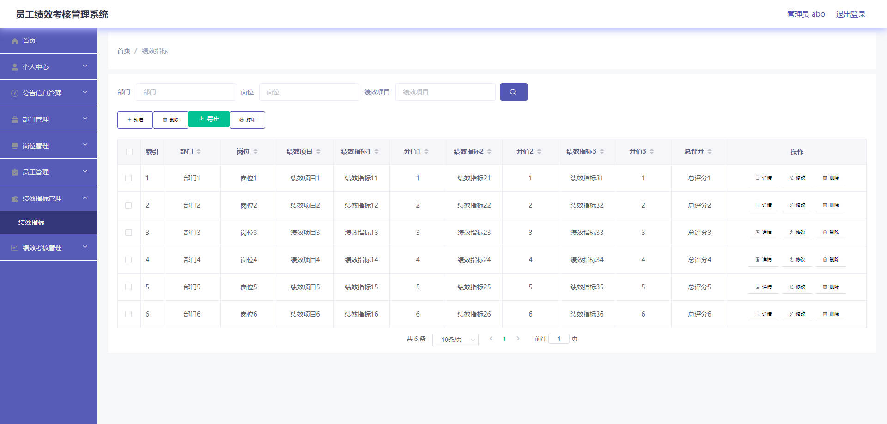
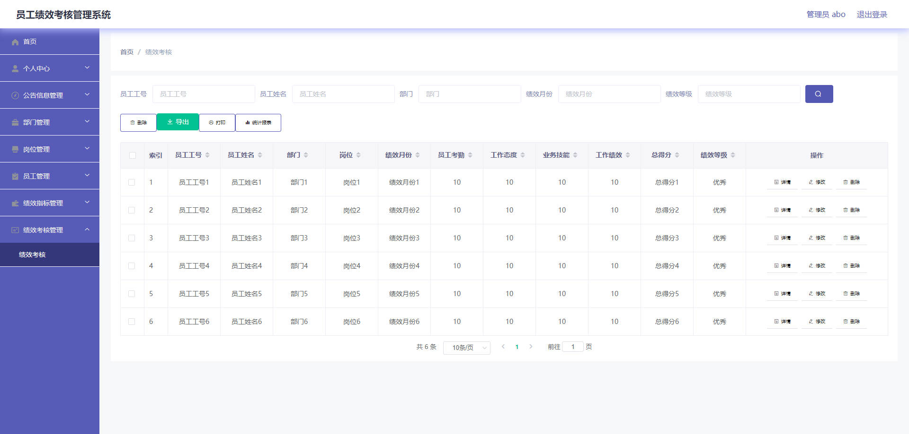
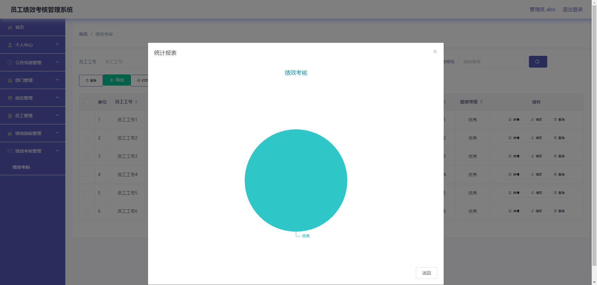
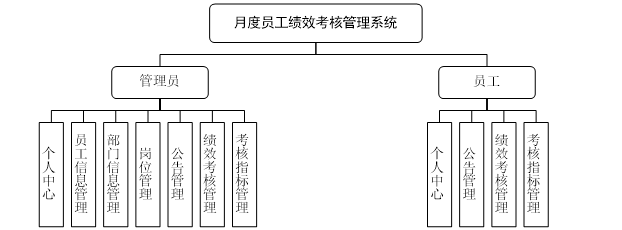
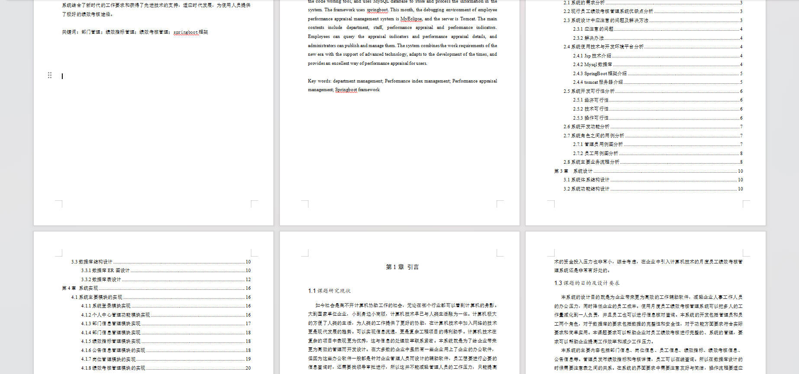

# 基于Springboot的月度员工绩效考核管理系统

## Springboot-0009


## 技术栈

Springboot mybatisplus vue mysql maven


## 数据库表(9张)


## 功能介绍

```properties
管理员
主要包括的内容有部门方面、员工方面、绩效考核方面、绩效指标方面。员工可以查询绩效指标和绩效考核详情，管理员进行发布和管理。
```


## 图片

### 前台

### 后台









## 访问路径

### 前台

```properties

```

### 后台

```properties
http://localhost:8080/springboot57n6g/admin/dist/index.html#/login

账号 abo
密码 abo
```


## 功能图




## 文档目录




## 打赏或交流


